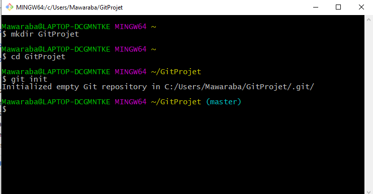
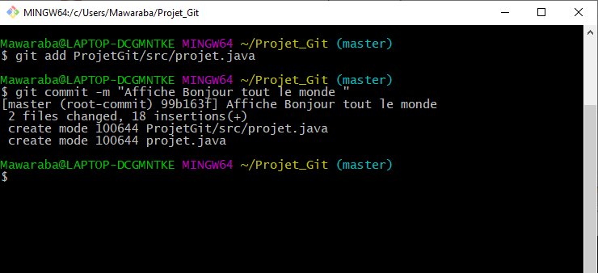
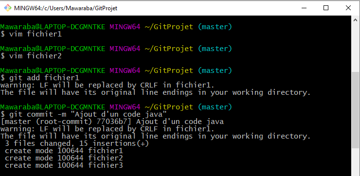
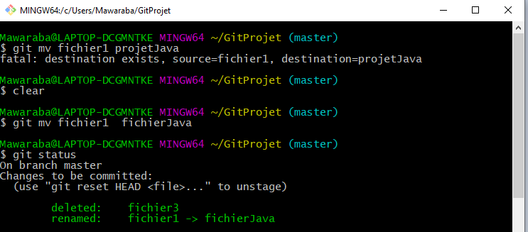
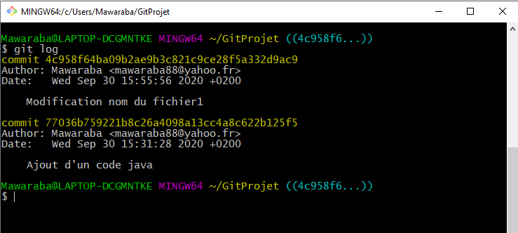
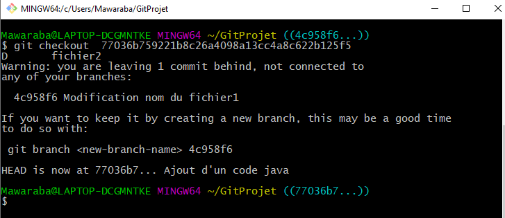
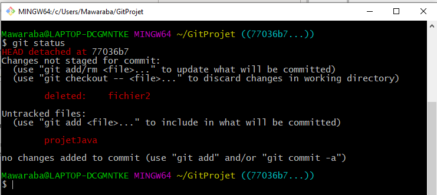
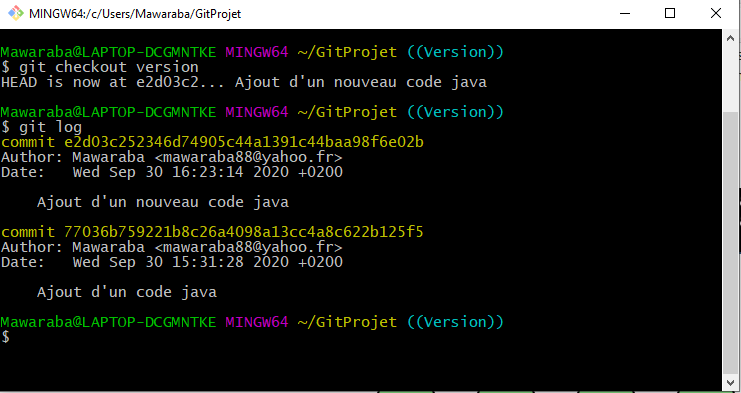
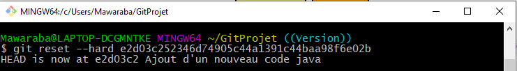

# Installation Git

***Git*** a bien été installé. 
Il peut accéder à l’extérieur en récuperant le document presence19-09-19.

# Dépôt Local

Un dépot local est un dossier que Git versionnalise.
Ce dossier contiendra les différents commits

## Initialisé un dépot

- On creer un dossier avec la commande ***mkdir***
- Avec la commande ***git init*** on initialise un dépot

## Ajout de fichier

 - Avec la commande ***touch***, on crée un ou plusieurs fichiers
 

## Modification et commits

- Modification du contenu des fichiers crées avec la commande ***vmir***
- On ajoute le fichier modifié avec la commande ***git add***
- On fait un commit avec la commande ***git commit -m***

## Renommer les fichiers et Supprimer les fichiers

- Avec la commande ***git mv***, on renomme les fichiers
- Avec la commande ***git rm***, on supprime les fichiers

## Afficher historique des commits

- Avec la commange ***git log***, on affiche l'historique
des commits

## Etat précedent du dépot

- Avec la commande ***git checkout***, on peut revenir sur le 
précedent dépôt

## Etat correspondant au commit

- Avec la commande ***git status***, on peut voir l'état correspondant
au commit

## Ajout d'une etiquette à un ancien commit et historique des commits
- Avec la commande ***git tag***, ont peut ajouter une étiquette
à un ancien commit

## Suppression des commits

- Avec la commande ***git reset --hard***

